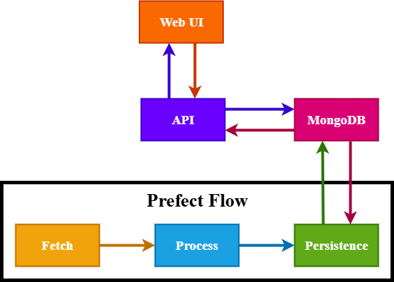

# System Architecture

Below is a high-level architecture diagram showing how the different components of the system interact:



*System architecture showing the flow from News APIs through Prefect orchestration, MongoDB storage, FastAPI backend, and Web Frontend*

## Data Flow

1. The NewsAPI fetcher retrieves raw article data from external news sources
2. The processing pipeline filters, cleans, and classifies the articles
3. Processed articles are stored in MongoDB with topic classifications
4. The FastAPI service provides endpoints to query articles by topic, date, etc.
5. The web interface consumes these endpoints to display articles to users

## Scalability Considerations

The system architecture allows for several scaling strategies:

1. **Horizontal Scaling**: Multiple worker instances can process different batches of news data
2. **Database Sharding**: MongoDB collections can be sharded for larger datasets
3. **Microservice Deployment**: The API layer can be deployed separately from the processing pipeline
4. **Cloud Deployment**: Prefect Cloud enables distributed task execution across multiple workers

## Module Descriptions

### Fetch Layer (`src/fetch/`)

The fetch layer is responsible for retrieving news articles from external APIs:

- **`fetcher.py`**: Defines the abstract base class interface for all fetchers
- **`factory.py`**: Factory pattern implementation for creating fetcher instances
- **`fetchers/news_api_fetcher.py`**: Implementation for NewsAPI source
  
This module follows the Strategy pattern, allowing easy extension to support additional news sources by implementing new fetcher classes.

### Processing Layer (`src/process/`)

The processing layer filters, cleans, and classifies news articles:

- **`process_data.py`**: Contains the main processing pipeline functions:
  - Converts raw API responses to standardized ArticleEntry objects
  - Removes incomplete articles (missing titles, content, etc.)
  - Filters articles based on content size and other criteria
  - Classifies articles into topics using keyword matching
  - Optionally retrieves full text content from article URLs

The processing logic is designed as a pipeline of transformations, making it easy to add or modify processing steps.

#### Document Classification System

The system uses a keyword-based classification mechanism to categorize articles into topics. This is a simple approach designed primarily for development and demonstration purposes, rather than production-grade classification. For production environments, more sophisticated NLP or ML-based classification would be recommended.

1. **Topic Dictionary Definition**: 
   - Topics are defined in `src/core/topic_dictionary.py` as a dictionary where:
     - Keys represent topic names (e.g., "ai", "marketing", "science")
     - Values are lists of keywords associated with each topic

2. **Classification Algorithm**:
   - For each article, the system:
     - Initializes a score of 0 for each topic
     - Concatenates the article title and content text
     - Normalizes the text (lowercase, remove punctuation)
     - For each topic's keywords:
       - Counts occurrences of each keyword in the normalized text
       - Adds the count to the topic's score
     - Assigns topics with scores exceeding the configured threshold (`SCORE_THRESHOLD`) to the article

3. **Example Classification**:
   ```python
   # Example topic dictionary
   TOPIC_KEYWORDS = {
     "ai": ["artificial intelligence", "machine learning", "neural network", "deep learning"],
     "science": ["research", "experiment", "discovery", "scientific"]
   }
   
   # For an article containing:
   # "New Research on Neural Networks Shows Promise for Medical Diagnoses"
   # It would match:
   #  - "research" (science): +1
   #  - "neural network" (ai): +1
   # With SCORE_THRESHOLD=1, it would be tagged with both "ai" and "science"
   ```

4. **Classification Weighting**:
   - Keywords can have different weights by repeating them in the list
   - Phrases (multi-word keywords) are checked as exact matches
   - The system prioritizes higher scores when sorting results with `sort_by_match=true`

This approach provides a simple way to classify articles, with customizable sensitivity through the threshold configuration. While sufficient for development and testing purposes, a production system would likely benefit from more sophisticated approaches like:

- Machine learning-based text classification
- Pre-trained NLP models for topic extraction
- Entity recognition and relationship extraction
- Semantic analysis beyond simple keyword matching

### Persistence Layer (`src/persistence/`)

The persistence layer handles data storage and retrieval:

- **`database.py`**: Abstract interface for storage backends
- **`factory.py`**: Factory for creating database instances
- **`mongo/connection.py`**: MongoDB connection management
- **`mongo/mongo_database.py`**: MongoDB implementation of the persistence interface

This architecture allows for potential support of different databases by implementing new classes conforming to the `DataPersistence` interface.

### Core Components (`src/core/`)

Core components provide shared functionality across the application:

- **`config.py`**: Configuration management using Pydantic Settings
- **`topic_dictionary.py`**: Topic definitions and keyword dictionaries

### Schema Definitions (`src/schemas/`)

- **`schemas.py`**: Defines the `ArticleEntry` Pydantic model that serves as the primary data transfer object throughout the system

### Workflow Orchestration (`src/flows/`)

- **`news_pipeline.py`**: Defines the Prefect workflow that orchestrates the fetching, processing, and storage tasks
- Task definitions with appropriate dependencies and error handling

### API Layer (`src/api/`)

- **`main.py`**: FastAPI application that provides endpoints for retrieving articles
- **`html/`**: Static web interface that consumes the API

### Deployment Tools (`src/`)

- **`serve.py`**: Script for locally serving the Prefect workflow
- **`deploy.py`**: Script for deploying the workflow to Prefect Cloud or a local Prefect server

## Roadmap

For a comprehensive list of planned enhancements and potential improvements to the News Feed Pipeline, see the [Future Improvements](future_improvements.md) document. This includes:

- Advanced ML-based classification mechanisms
- Additional data sources and fetchers
- Alternative persistence options
- Enhanced user experience features
- Infrastructure and operational improvements

